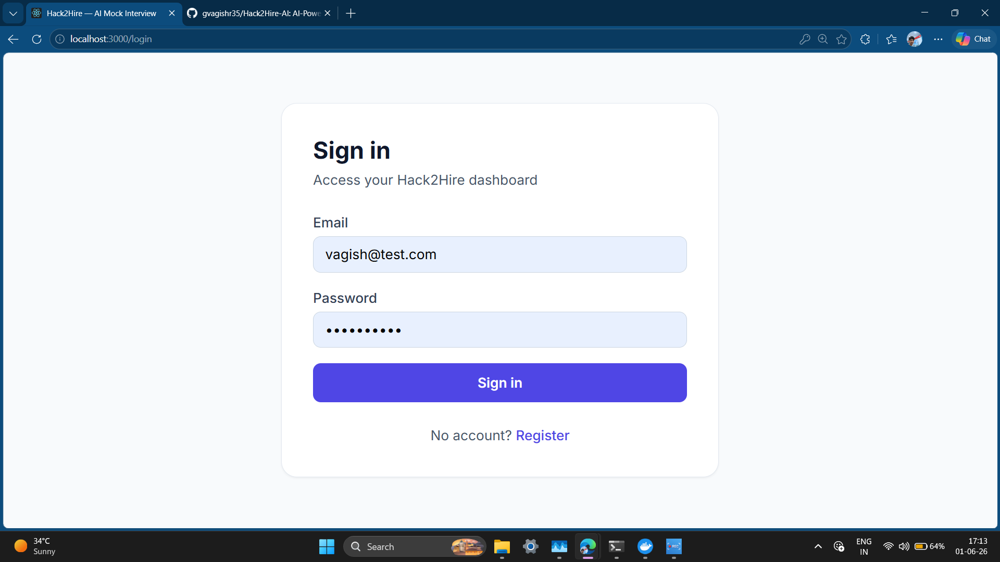
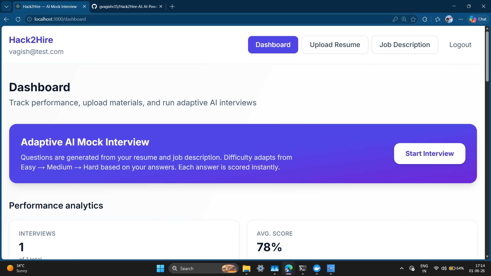
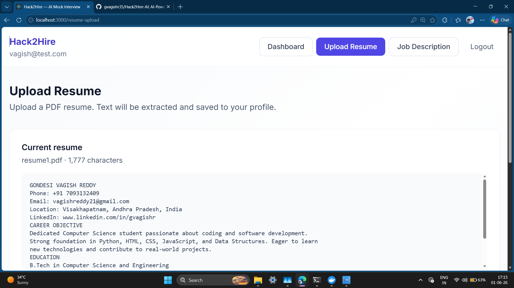
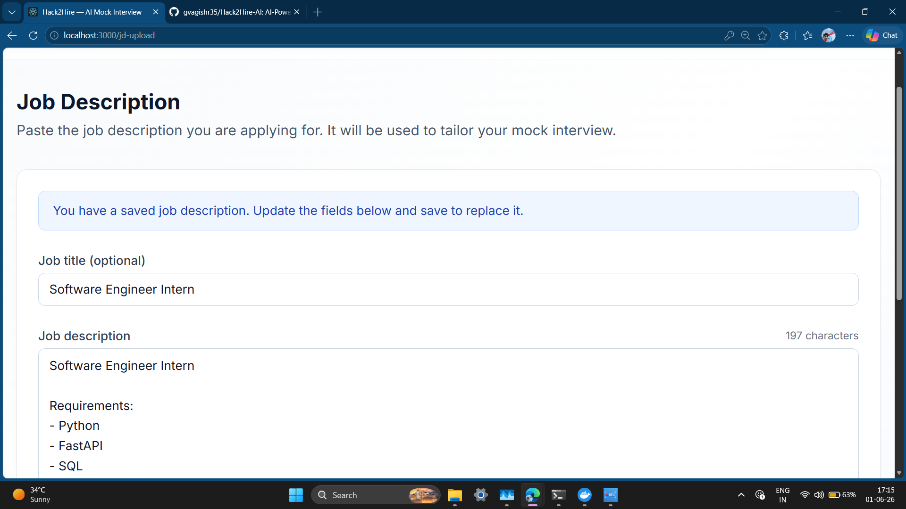
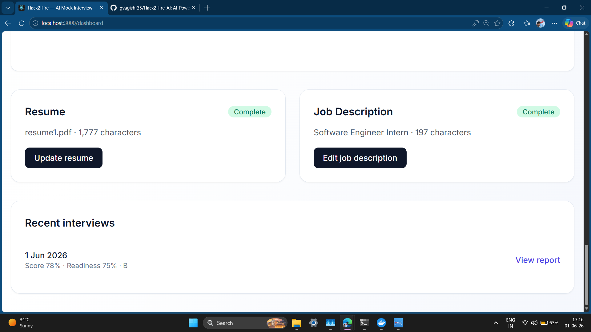
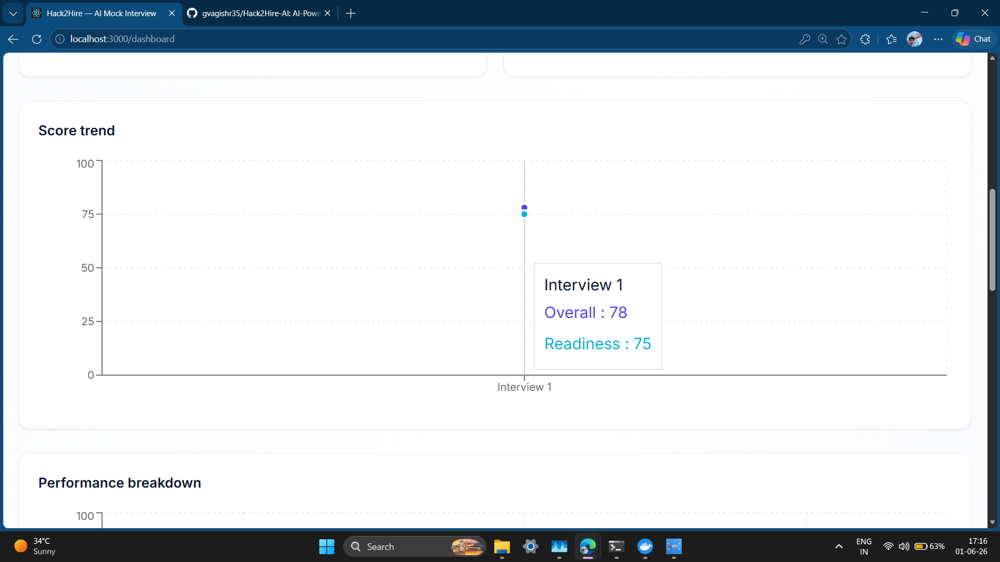

# 🚀 Hack2Hire – AI Powered Mock Interview Platform

## 📌 Overview

Hack2Hire is an AI-powered mock interview platform designed to help candidates prepare for real-world technical interviews through structured evaluation, adaptive questioning, and interview readiness assessment.

The platform analyzes a candidate's resume and job description, conducts an intelligent interview session, evaluates performance, and generates a comprehensive readiness report with actionable feedback.

Built as a submission for the **Hack2Hire: AI-Powered Interview Hackathon**.

---

# 🎯 Problem Statement

Many students struggle during real interviews because of:

* Lack of realistic interview practice
* Unstructured feedback
* Poor time management evaluation
* No adaptive interview experience
* No measurable readiness score

Hack2Hire solves this problem by simulating a structured interview environment and generating an objective interview readiness assessment.

---

# ✨ Features

## 📄 Resume Analysis

* Upload PDF Resume
* Extract candidate information
* Analyze projects and skills
* Store profile for interview personalization

## 💼 Job Description Analysis

* Upload target Job Description
* Match role requirements
* Generate role-specific interview context

## 🤖 Adaptive AI Interview Engine

* Technical Questions
* Behavioral Questions
* Experience-Based Questions
* Difficulty Progression:

  * Easy
  * Medium
  * Hard

## ⏱️ Time Aware Interview System

* Per-question timer
* Time tracking
* Interview state management

## 📊 Performance Evaluation

Candidate responses are evaluated using:

* Accuracy
* Relevance
* Clarity
* Communication
* Technical Understanding

## 🏆 Final Interview Readiness Report

The platform generates:

* Overall Score
* Readiness Score
* Grade
* Strengths
* Weaknesses
* Recommendations
* Question-wise Feedback

---

# 🛠️ Tech Stack

## Frontend

* React
* Next.js
* TypeScript

## Backend

* FastAPI
* Python

## Database

* PostgreSQL

## Cache Layer

* Redis

## Deployment

* Docker
* Docker Compose

---

# 🏗️ System Architecture

```text
Candidate
     │
     ▼
Resume Upload
     │
     ▼
Job Description Upload
     │
     ▼
Interview Engine
     │
     ▼
Adaptive Evaluation
     │
     ▼
Readiness Scoring
     │
     ▼
Final Interview Report
```

---

# 📸 Screenshots

## Login Page



---

## Dashboard



---

## Resume Analysis



---

## Project Description / Job Description



---

## Interview Session



---

## Skill Trends & Performance Report



---

# ⚙️ Local Setup

## Clone Repository

```bash
git clone https://github.com/gvagishr35/Hack2Hire-AI.git
cd Hack2Hire-AI
```

## Run Using Docker

```bash
docker compose up -d --build
```

## Frontend

```text
http://localhost:3000
```

## Backend

```text
http://localhost:8000
```

## API Documentation

```text
http://localhost:8000/docs
```

---

# 📈 Evaluation Metrics

The platform evaluates candidates on:

* Technical Knowledge
* Communication Skills
* Relevance
* Problem Solving
* Time Management

Final outputs include:

* Interview Readiness Score
* Hiring Readiness Indicator
* Performance Breakdown
* Actionable Recommendations

---

# 🔮 Future Improvements

* Real LLM-powered Interview Evaluation
* Voice-based Interview Sessions
* AI Follow-up Questions
* Webcam Proctoring
* Multi-role Interview Support
* Advanced Analytics Dashboard
* Recruiter View Panel

---

# 👨‍💻 Author

**Gondesi Vagish Reddy**

B.Tech – Computer Science & Engineering

Hack2Hire AI-Powered Interview Hackathon Submission

---

## ⭐ If you like this project, consider giving it a star.
