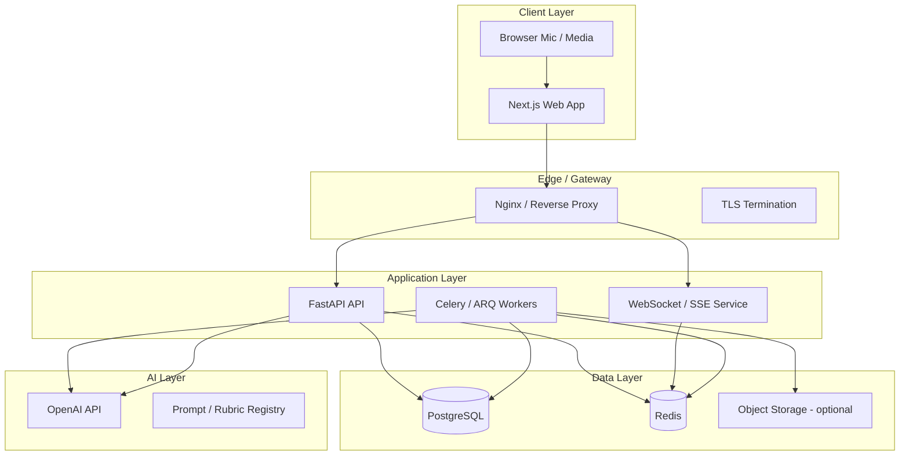
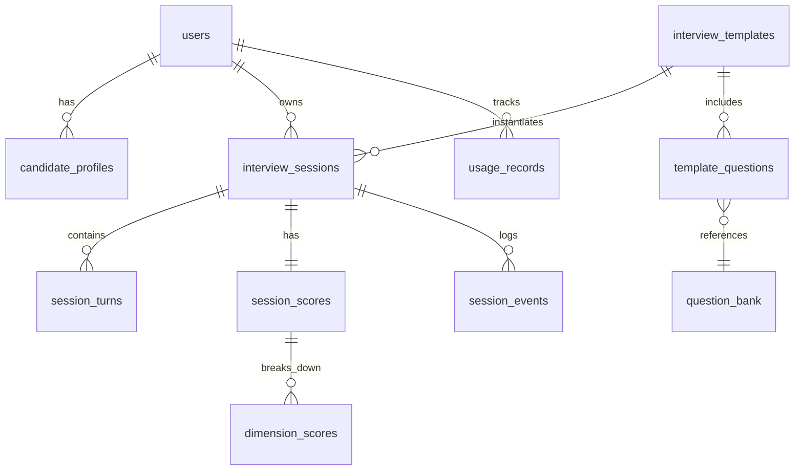
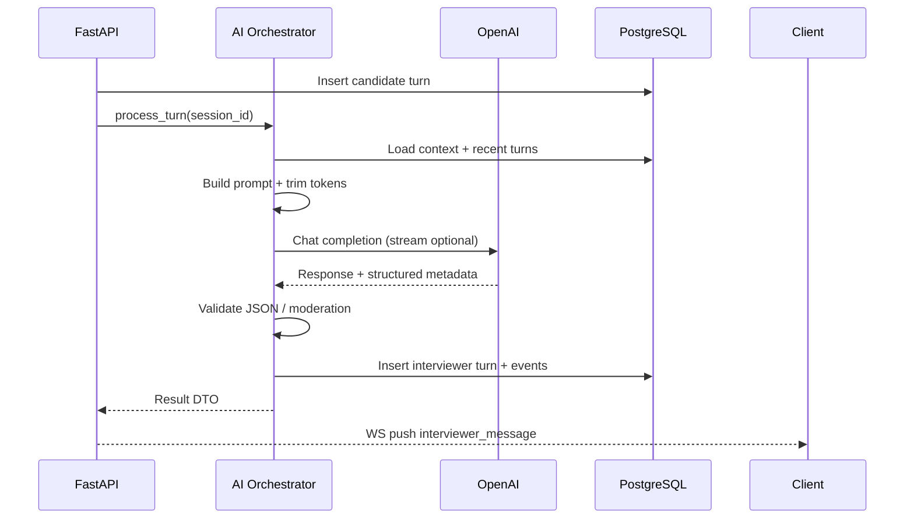
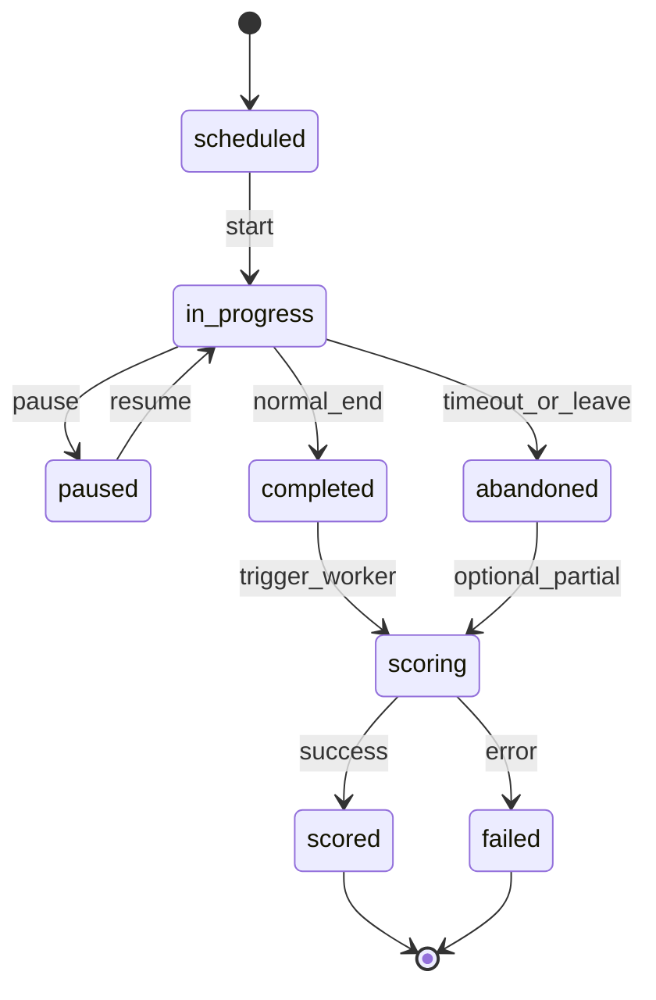
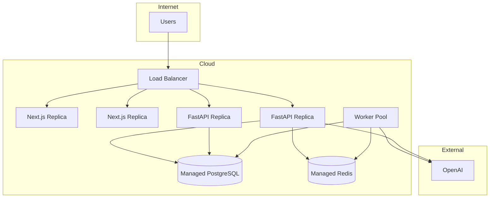

# Hack2Hire AI Mock Interview Platform — Principal Architecture


## 1. Complete System Architecture

### 1.1 High-Level View



### 1.2 Architectural Style

| Choice | Rationale |
|--------|-----------|
| **Modular monolith (FastAPI)** | Single deployable API with clear domain modules; split to microservices only when scale demands it. |
| **BFF via Next.js** | Server Components and Route Handlers proxy auth-sensitive calls; browser talks to same origin. |
| **Async workers** | Long OpenAI calls (scoring, report generation) must not block HTTP threads. |
| **Event-driven interview state** | Interview progression is a state machine; transitions are logged for audit and replay. |

### 1.3 Core Domains (Bounded Contexts)

| Domain | Responsibility |
|--------|----------------|
| **Identity & Access** | Registration, login, JWT/session, roles (candidate, admin). |
| **Profile & Resume** | Candidate profile, skills, target role, parsed resume metadata. |
| **Interview Catalog** | Templates (SDE, PM, behavioral), difficulty tiers, question banks. |
| **Session Runtime** | Live interview orchestration, turn-taking, timers, adaptive branching. |
| **AI Orchestration** | Prompt assembly, model routing, token budgets, retries, safety filters. |
| **Scoring & Analytics** | Rubric-based evaluation, dimension scores, final report, history trends. |
| **Billing & Limits** (optional) | Free tier caps, premium interviews, usage metering. |
| **Admin** | Template CRUD, moderation, system prompts, feature flags. |

### 1.4 Component Deep Dive

#### Next.js Frontend
- **App Router** for layouts: marketing, dashboard, live interview room, results.
- **Client islands** only where needed: microphone, waveform, real-time transcript, timer.
- **State**: server state via React Query/SWR; interview room uses lightweight client store (Zustand) for ephemeral UI.
- **Auth**: HTTP-only cookies set by backend or Next middleware; no long-lived tokens in `localStorage`.
- **Media**: Web Speech API or chunked upload to backend for STT path (see AI workflow).

#### FastAPI Backend
- **API surface**: REST for CRUD; WebSocket or SSE for streaming interviewer replies and partial scores.
- **Layers**: routers → services → repositories → SQLAlchemy/asyncpg.
- **Validation**: Pydantic v2 schemas mirroring API contracts.
- **Cross-cutting**: correlation IDs, structured logging, rate limiting, CORS, dependency-injected DB sessions.

#### PostgreSQL
- System of record: users, sessions, turns, scores, templates, audit logs.
- JSONB for flexible rubric metadata and AI raw responses (with retention policy).

#### Redis
- Session pub/sub for live room updates.
- Job queue broker (Celery/ARQ).
- Rate limit counters, idempotency keys, short-lived interview locks.

#### OpenAI
- **Chat Completions** (or Responses API): interviewer persona, follow-ups, hints.
- **Structured outputs**: scoring JSON matching rubric schema.
- Optional **Whisper** or third-party STT if not using browser STT.

#### Workers
- Post-interview scoring pipeline.
- Resume parsing enrichment.
- Email/report PDF generation (future).

### 1.5 Non-Functional Requirements

| Concern | Approach |
|---------|----------|
| **Latency** | Stream first token of AI reply; prefetch next question candidates in background. |
| **Reliability** | Idempotent `POST /sessions/{id}/turns`; retry with exponential backoff on OpenAI 429/5xx. |
| **Security** | RBAC, row-level ownership checks, PII encryption at rest for resume blobs, secrets via env/vault. |
| **Observability** | OpenTelemetry traces across API → worker → OpenAI; metrics: tokens, latency, score distribution. |
| **Compliance** | Data retention jobs; user data export/delete endpoints. |

### 1.6 Request Flow (Typical Interview Turn)

1. Candidate speaks → audio/text captured in browser.
2. Next.js sends turn payload to FastAPI (`answer_text` or audio reference).
3. API persists **Turn** (status: `received`), enqueues or inline-calls AI orchestrator.
4. Orchestrator builds context: template, prior turns, difficulty, rubric hints.
5. OpenAI returns interviewer message + optional internal signals (difficulty delta, topic tags).
6. API persists AI message, updates session state machine, pushes event via WebSocket/SSE.
7. Frontend renders new question; timer resets.

---

## 2. Folder Structure

Monorepo layout keeps contracts aligned without mixing concerns.

```
hack2hire-ai-interview/
├── docker/
│   ├── docker-compose.yml
│   ├── docker-compose.prod.yml
│   └── nginx/
│       └── default.conf
│
├── docs/
│   ├── architecture/
│   ├── api/                    # OpenAPI export, ADRs
│   └── runbooks/
│
├── frontend/                   # Next.js
│   ├── public/
│   ├── src/
│   │   ├── app/                # App Router routes
│   │   │   ├── (marketing)/
│   │   │   ├── (auth)/
│   │   │   ├── dashboard/
│   │   │   ├── interview/[sessionId]/
│   │   │   └── api/            # BFF proxies (thin)
│   │   ├── components/
│   │   │   ├── ui/             # primitives (buttons, cards)
│   │   │   ├── interview/      # room, timer, transcript
│   │   │   └── dashboard/
│   │   ├── hooks/
│   │   ├── lib/                # api client, auth helpers
│   │   ├── stores/             # client state
│   │   ├── types/              # TS types (generated from OpenAPI optional)
│   │   └── styles/
│   ├── tailwind.config.ts
│   ├── next.config.ts
│   ├── package.json
│   └── Dockerfile
│
├── backend/                    # FastAPI
│   ├── app/
│   │   ├── main.py
│   │   ├── core/               # config, security, logging, deps
│   │   ├── api/
│   │   │   └── v1/
│   │   │       ├── routers/    # auth, users, sessions, templates, admin
│   │   │       └── websocket/
│   │   ├── domain/             # entities, enums, state machines
│   │   ├── services/           # business logic per bounded context
│   │   ├── ai/
│   │   │   ├── orchestrator.py
│   │   │   ├── prompts/        # versioned prompt templates (not secrets)
│   │   │   ├── schemas/        # structured output JSON schemas
│   │   │   └── policies/       # token limits, model map
│   │   ├── repositories/
│   │   ├── models/             # SQLAlchemy ORM
│   │   ├── schemas/            # Pydantic request/response
│   │   ├── workers/            # Celery/ARQ tasks
│   │   └── migrations/         # Alembic
│   ├── tests/
│   │   ├── unit/
│   │   ├── integration/
│   │   └── fixtures/
│   ├── pyproject.toml
│   ├── alembic.ini
│   └── Dockerfile
│
├── shared/                     # optional: OpenAPI spec, enum constants
│   └── openapi.yaml
│
├── scripts/
│   ├── seed_db.sh
│   └── generate_types.sh
│
├── .github/workflows/          # CI: lint, test, build images
├── .env.example
└── README.md
```

### Folder Responsibilities

| Path | Purpose |
|------|---------|
| `frontend/src/app/interview/[sessionId]` | Live room: transcript, controls, connection status. |
| `backend/app/ai/prompts` | Versioned interviewer/scorer prompts; change = new version row in DB. |
| `backend/app/workers` | Async scoring, report build; never import heavy logic in routers directly. |
| `backend/migrations` | Schema evolution; all DDL via Alembic. |
| `docker/` | Compose stacks for local and prod parity. |

---

## 3. Database Design

### 3.1 ER Overview



### 3.2 Table Specifications

#### `users`
| Column | Type | Notes |
|--------|------|-------|
| id | UUID PK | |
| email | VARCHAR UNIQUE | |
| password_hash | VARCHAR | nullable if OAuth later |
| role | ENUM | `candidate`, `admin` |
| created_at, updated_at | TIMESTAMPTZ | |

#### `candidate_profiles`
| Column | Type | Notes |
|--------|------|-------|
| id | UUID PK | |
| user_id | UUID FK → users | UNIQUE |
| display_name | VARCHAR | |
| target_role | VARCHAR | e.g. "Backend SDE" |
| experience_years | INT | |
| skills | JSONB | string[] |
| resume_text | TEXT | parsed plain text |
| resume_metadata | JSONB | sections, companies |

#### `interview_templates`
| Column | Type | Notes |
|--------|------|-------|
| id | UUID PK | |
| slug | VARCHAR UNIQUE | `sde-junior-v1` |
| title | VARCHAR | |
| type | ENUM | `technical`, `behavioral`, `system_design`, `mixed` |
| default_duration_minutes | INT | |
| rubric_id | UUID FK | |
| config | JSONB | topics, max questions, adaptive rules |
| is_active | BOOLEAN | |
| prompt_version | VARCHAR | links to AI prompt set |

#### `question_bank`
| Column | Type | Notes |
|--------|------|-------|
| id | UUID PK | |
| topic | VARCHAR | `arrays`, `leadership` |
| difficulty | INT | 1–5 |
| question_text | TEXT | |
| evaluation_hints | JSONB | what good answers contain |
| tags | JSONB | |

#### `template_questions`
| Column | Type | Notes |
|--------|------|-------|
| id | UUID PK | |
| template_id | UUID FK | |
| question_id | UUID FK → question_bank | |
| sort_order | INT | optional seed order |

#### `rubrics`
| Column | Type | Notes |
|--------|------|-------|
| id | UUID PK | |
| name | VARCHAR | |
| dimensions | JSONB | `[{key, weight, description}]` |

#### `interview_sessions`
| Column | Type | Notes |
|--------|------|-------|
| id | UUID PK | |
| user_id | UUID FK | |
| template_id | UUID FK | |
| status | ENUM | see state machine below |
| current_difficulty | INT | 1–5 adaptive level |
| started_at, ended_at | TIMESTAMPTZ | |
| settings | JSONB | duration override, voice on/off |
| context_snapshot | JSONB | frozen profile + template at start |

**`status` enum:** `scheduled`, `in_progress`, `paused`, `completed`, `abandoned`, `scoring`, `scored`, `failed`

#### `session_turns`
| Column | Type | Notes |
|--------|------|-------|
| id | UUID PK | |
| session_id | UUID FK | |
| turn_index | INT | UNIQUE per session |
| speaker | ENUM | `interviewer`, `candidate` |
| content_text | TEXT | |
| audio_url | VARCHAR | optional S3 path |
| duration_seconds | INT | |
| metadata | JSONB | STT confidence, tokens used |
| created_at | TIMESTAMPTZ | |

#### `session_events` (audit / state machine)
| Column | Type | Notes |
|--------|------|-------|
| id | BIGSERIAL PK | |
| session_id | UUID FK | |
| event_type | VARCHAR | `DIFFICULTY_UP`, `TOPIC_SWITCH` |
| payload | JSONB | |
| created_at | TIMESTAMPTZ | |

#### `session_scores`
| Column | Type | Notes |
|--------|------|-------|
| id | UUID PK | |
| session_id | UUID FK UNIQUE | |
| overall_score | NUMERIC(5,2) | 0–100 |
| grade | VARCHAR | `A`–`F` or `Strong Hire` |
| summary | TEXT | narrative feedback |
| strengths | JSONB | string[] |
| improvements | JSONB | string[] |
| raw_ai_response | JSONB | retained per policy |
| scored_at | TIMESTAMPTZ | |
| scorer_model | VARCHAR | |
| prompt_version | VARCHAR | |

#### `dimension_scores`
| Column | Type | Notes |
|--------|------|-------|
| id | UUID PK | |
| session_score_id | UUID FK | |
| dimension_key | VARCHAR | `problem_solving`, `communication` |
| score | NUMERIC(5,2) | |
| evidence | TEXT | cites turn indices |
| weight | NUMERIC(3,2) | copied from rubric at score time |

#### `ai_usage_logs`
| Column | Type | Notes |
|--------|------|-------|
| id | BIGSERIAL PK | |
| session_id | UUID FK nullable | |
| operation | VARCHAR | `interview_turn`, `score`, `parse_resume` |
| model | VARCHAR | |
| input_tokens, output_tokens | INT | |
| latency_ms | INT | |
| cost_estimate_usd | NUMERIC | |

#### `usage_records` (quotas)
| Column | Type | Notes |
|--------|------|-------|
| id | UUID PK | |
| user_id | UUID FK | |
| period | DATE | month bucket |
| interviews_started | INT | |

### 3.3 Indexing Strategy

- `interview_sessions (user_id, created_at DESC)` — dashboard history.
- `session_turns (session_id, turn_index)` — transcript load.
- `question_bank (topic, difficulty)` — adaptive picker.
- Partial index on `interview_sessions (status)` where `in_progress` for ops dashboards.

### 3.4 Data Retention

- Raw AI responses: 90 days default, configurable.
- Audio: 30 days or delete on score completion if privacy mode.
- Anonymized aggregates kept for analytics.

---

## 4. API Design

Base path: `/api/v1`. All responses JSON unless streaming. Auth: `Authorization: Bearer <JWT>` or session cookie.

### 4.1 Auth

| Method | Path | Description |
|--------|------|-------------|
| POST | `/auth/register` | Create candidate account |
| POST | `/auth/login` | Issue access + refresh tokens |
| POST | `/auth/refresh` | Rotate access token |
| POST | `/auth/logout` | Invalidate refresh token |
| GET | `/auth/me` | Current user + profile summary |

### 4.2 Profile & Resume

| Method | Path | Description |
|--------|------|-------------|
| GET | `/profiles/me` | Full candidate profile |
| PATCH | `/profiles/me` | Update skills, target role |
| POST | `/profiles/me/resume` | Upload resume (multipart); triggers parse job |
| GET | `/profiles/me/resume/status` | Parse job status |

### 4.3 Templates & Catalog

| Method | Path | Description |
|--------|------|-------------|
| GET | `/templates` | List active templates (filter by type) |
| GET | `/templates/{slug}` | Template detail + rubric summary |

### 4.4 Interview Sessions

| Method | Path | Description |
|--------|------|-------------|
| POST | `/sessions` | Body: `{ template_slug, settings? }` → creates session, returns `session_id`, WS URL |
| GET | `/sessions` | Paginated history for user |
| GET | `/sessions/{id}` | Session metadata + status |
| POST | `/sessions/{id}/start` | Transition `scheduled` → `in_progress`; first interviewer turn |
| POST | `/sessions/{id}/pause` | Pause timer |
| POST | `/sessions/{id}/resume` | Resume |
| POST | `/sessions/{id}/end` | Candidate ends early → `scoring` |
| DELETE | `/sessions/{id}` | Soft-delete if allowed |

### 4.5 Turns (Core Runtime)

| Method | Path | Description |
|--------|------|-------------|
| GET | `/sessions/{id}/turns` | Full transcript |
| POST | `/sessions/{id}/turns` | Submit candidate answer `{ text?, audio_upload_id? }` → AI follow-up |
| POST | `/sessions/{id}/turns/{turn_id}/hint` | Optional hint (counts against quota) |

**Idempotency:** Header `Idempotency-Key` on POST turns to prevent duplicate submissions on retry.

### 4.6 Real-Time

| Protocol | Path | Description |
|----------|------|-------------|
| WebSocket | `/ws/sessions/{id}` | Events: `interviewer_message`, `status_change`, `timer_tick`, `scoring_progress` |
| SSE (alt) | `/sessions/{id}/stream` | Same events over SSE if WS blocked |

### 4.7 Scores & Reports

| Method | Path | Description |
|--------|------|-------------|
| GET | `/sessions/{id}/score` | 404 until `scored`; returns dimensions + narrative |
| GET | `/sessions/{id}/score/status` | `pending`, `processing`, `complete`, `failed` |

### 4.8 Analytics (Candidate)

| Method | Path | Description |
|--------|------|-------------|
| GET | `/analytics/overview` | Avg scores, weak dimensions, interview count |
| GET | `/analytics/trends` | Time series by dimension |

### 4.9 Admin (role-gated)

| Method | Path | Description |
|--------|------|-------------|
| CRUD | `/admin/templates` | Manage templates |
| CRUD | `/admin/questions` | Question bank |
| CRUD | `/admin/rubrics` | Rubrics |
| GET | `/admin/sessions` | Support lookup |
| PATCH | `/admin/prompts/{version}` | Prompt version management |

### 4.10 Standard Conventions

- **Pagination:** `?page=1&limit=20` → `{ items, total, page, limit }`
- **Errors:** `{ "error": { "code": "SESSION_NOT_FOUND", "message": "..." } }`
- **HTTP codes:** 201 create, 202 accepted (async scoring), 409 invalid state transition, 429 quota exceeded

### 4.11 OpenAPI

- FastAPI auto-generates spec at `/openapi.json`.
- Frontend types generated in CI from spec (optional `shared/openapi.yaml` export).

---

## 5. AI Workflow

### 5.1 Model Roles

| Role | Model (example) | Input | Output |
|------|-----------------|-------|--------|
| **Interviewer** | GPT-4o / GPT-4o-mini | System + session context + last answer | Next question, tone, internal tags |
| **Turn analyzer** | GPT-4o-mini | Single Q&A pair | Quality signal, topic mastery estimate |
| **Scorer** | GPT-4o | Full transcript + rubric | Structured dimension scores + narrative |
| **Resume parser** | GPT-4o-mini | Resume text | Structured profile fields |
| **Safety moderator** | small model or rules | User/AI text | Block or flag |

### 5.2 Prompt Architecture

Each prompt is **versioned** (`prompt_version` on template and score rows):

1. **System layer:** persona (professional interviewer), constraints (no hiring decisions, educational tone), safety rules.
2. **Context layer:** template config, candidate profile snapshot, current difficulty, topics covered.
3. **Transcript layer:** last N turns (token-budgeted); older turns summarized by a rolling summary stored in `interview_sessions.context_snapshot` or `session_events`.
4. **Instruction layer:** task for this call (ask follow-up, change topic, close interview).
5. **Output contract:** JSON schema for structured fields (difficulty_delta, topic, interviewer_message).

### 5.3 Interview Turn Pipeline



### 5.4 Token & Cost Management

- Cap transcript window; compress history every K turns via summarization call.
- Use **mini** for analyzer; **full** for scorer and complex system design.
- Log every call in `ai_usage_logs`.
- Per-user monthly token budget enforced before `start`.

### 5.5 Failure Handling

| Failure | Behavior |
|---------|----------|
| 429 rate limit | Queue retry in worker with backoff |
| Invalid JSON | Repair pass (single retry with “fix JSON” instruction) |
| Moderation hit | Replace with safe fallback question; log event |
| Timeout | Return 202 + poll; or graceful “please repeat your answer” |

### 5.6 Speech Path (Optional)

1. Browser STT → `text` in POST turn (lowest latency).
2. Or upload audio chunk → backend Whisper → text → same pipeline.

---

## 6. Adaptive Interview Workflow

### 6.1 Goals

- Match question difficulty to demonstrated skill.
- Cover breadth (topics) without exhausting time.
- Mimic real interviews: follow-ups, probes, occasional stress topics.

### 6.2 State Machine (Session)



### 6.3 Adaptive Variables (per session)

| Variable | Range | Updated when |
|----------|-------|--------------|
| `current_difficulty` | 1–5 | Turn analyzer signal |
| `topic_coverage` | map topic → depth | After each turn |
| `time_budget_remaining` | seconds | Timer service |
| `follow_up_depth` | 0–3 | Consecutive probes on same question |
| `candidate_fatigue` | heuristic | Long pauses, short answers |

### 6.4 Decision Logic (Conceptual)

After each candidate answer, **Turn Analyzer** returns:

- `answer_quality`: weak | adequate | strong  
- `topic`: string  
- `suggested_action`: follow_up | harder_question | easier_question | new_topic | wrap_up  

**Rules engine** (deterministic, testable) merges AI suggestion with guards:

| Condition | Action |
|-----------|--------|
| 3 strong answers in a row | `difficulty += 1` (max 5) |
| 2 weak answers in a row | `difficulty -= 1` (min 1) |
| `follow_up_depth < 2` and answer vague | Same topic follow-up |
| Topic uncovered & time > 50% | Pick new topic from template config |
| Time < 10% | `wrap_up` → closing question then end |
| Max questions reached | Force `completed` |

Question selection:

1. Filter `question_bank` by `topic` + `difficulty ± 1`.
2. Exclude questions already asked (stored in session context).
3. If empty, AI generates bespoke question (logged to bank after review).

### 6.5 Interviewer Orchestration

The **Interviewer** model receives:

- `suggested_action` and selected question seed text.
- Instruction to naturalize phrasing and reference prior answer (continuity).

### 6.6 Session Events (Audit)

Every adaptive decision writes `session_events` so you can explain to the candidate why difficulty changed and debug bad loops.

---

## 7. Scoring Workflow

### 7.1 Triggers

- Session enters `completed` (normal end or manual end).
- API sets status `scoring` and enqueues worker job `score_session(session_id)`.

### 7.2 Scoring Pipeline

```mermaid
flowchart LR
    A[Session completed] --> B[Load transcript + rubric + template]
    B --> C[Pre-process: anonymize PII snippets if needed]
    C --> D[Chunk if very long]
    D --> E[OpenAI Scorer structured call]
    E --> F[Validate against rubric schema]
    F --> G[Compute weighted overall]
    G --> H[Persist session_scores + dimension_scores]
    H --> I[Status scored + notify client]
```



### 7.3 Rubric Dimensions (Example — SDE)

| Dimension | Weight | What scorer evaluates |
|-----------|--------|------------------------|
| Problem solving | 30% | Approach, correctness, edge cases |
| Technical depth | 25% | Concepts, tradeoffs |
| Communication | 20% | Clarity, structure |
| Code / algorithm articulation | 15% | Even without IDE—how they explain |
| Culture / collaboration | 10% | Behavioral cues in transcript |

Weights stored in `rubrics.dimensions`; copied to `dimension_scores.weight` at score time for historical accuracy.

### 7.4 Scorer Prompt Inputs

- Full or summarized transcript with turn indices.
- Template type and seniority target.
- Rubric dimension definitions + scoring anchors (1–5 descriptors).
- Optional: per-turn analyzer outputs if stored in metadata.

### 7.5 Structured Output Contract

Scorer must return (conceptually):

- Per dimension: score 0–100, evidence quotes referencing `turn_index`, improvement tip.
- Overall narrative: 2–3 paragraphs.
- `strengths[]`, `improvements[]` (actionable).
- `recommended_study_topics[]`.

Validation layer rejects malformed responses; one repair retry; else `failed` status and ops alert.

### 7.6 Overall Score Calculation

Deterministic in backend (do not trust LLM arithmetic):

`overall = Σ (dimension_score × weight) / Σ weights`

Optional caps: e.g. critical safety violation → max score ceiling.

### 7.7 Post-Score UX

- Dashboard shows radar chart of dimensions vs previous sessions.
- “Compare to last attempt” uses prior `session_scores` for same template slug.

### 7.8 Quality Assurance

- Golden transcripts with expected score ranges in integration tests.
- Human review sampling queue for admin (future table `score_reviews`).

---

## 8. Deployment Plan

### 8.1 Environments

| Environment | Purpose | Data |
|-------------|---------|------|
| **local** | Docker Compose on developer machines | Seed DB, mock OpenAI optional |
| **staging** | Pre-prod, full integrations | Anonymized copy or synthetic |
| **production** | Live users | Managed PostgreSQL, real OpenAI keys |

### 8.2 Container Topology (Docker Compose)

| Service | Image | Ports | Notes |
|---------|-------|-------|-------|
| `frontend` | Next.js standalone | 3000 | `NODE_ENV=production` |
| `api` | FastAPI + Uvicorn | 8000 | Multiple workers behind proxy |
| `worker` | Same image, different CMD | — | Celery/ARQ consumer |
| `postgres` | postgres:16 | 5432 | Volume for data |
| `redis` | redis:7 | 6379 | Persistence optional |
| `nginx` | nginx:alpine | 80, 443 | Routes `/` → frontend, `/api` → api, `/ws` → api |

### 8.3 Production Topology (Scale-Up Path)



Start with **single VM + Compose** or **one PaaS** (Railway, Fly.io, AWS ECS); migrate to managed DB and horizontal API replicas when concurrent interviews exceed ~50–100.

### 8.4 Configuration & Secrets

| Secret | Where |
|--------|-------|
| `DATABASE_URL` | env / secret manager |
| `REDIS_URL` | env |
| `OPENAI_API_KEY` | env, never in repo |
| `JWT_SECRET` | env, rotate periodically |
| `NEXT_PUBLIC_API_URL` | build-time for browser |

Use `.env.example` documented; production via Docker secrets or cloud SM.

### 8.5 CI/CD Pipeline

1. **On PR:** lint (Ruff, ESLint), typecheck (mypy, `tsc`), unit tests, build Docker images.
2. **On merge to main:** push images to registry (GHCR/ECR), run migrations on staging, deploy staging, smoke test.
3. **Promote to prod:** manual approval, blue-green or rolling update, migration job as init container.

**Migration job:** `alembic upgrade head` once per deploy before traffic shift.

### 8.6 Health & Readiness

| Endpoint | Checks |
|----------|--------|
| `GET /health` | API alive |
| `GET /health/ready` | DB + Redis connectivity |
| Worker heartbeat | Queue depth metric |

### 8.7 Observability Stack (Recommended)

- **Logs:** JSON to stdout → Loki/CloudWatch.
- **Metrics:** Prometheus — request latency, active sessions, queue depth, OpenAI tokens.
- **Traces:** OpenTelemetry → Jaeger/Tempo.
- **Alerts:** scoring failure rate, OpenAI 429 spike, DB connection exhaustion.

### 8.8 Backup & DR

- PostgreSQL: daily automated backups, PITR on managed service.
- Redis: AOF if using it for more than cache; else rebuildable.
- RTO target: 4h (small team); RPO: 24h unless paid tier demands better.

### 8.9 Security Checklist (Deploy)

- TLS everywhere; HSTS on nginx.
- CORS allowlist production domain only.
- Rate limit auth and turn submission per IP/user.
- Non-root containers, read-only filesystem where possible.
- Network: DB and Redis not public.

### 8.10 Local Developer Experience

`docker compose up` brings postgres, redis, api, worker, frontend, nginx.  
Frontend hot-reload via volume mount optional override file `docker-compose.dev.yml`.

---

## Cross-Cutting Summary

| Area | Key decision |
|------|----------------|
| **Truth** | PostgreSQL for sessions, turns, scores |
| **Speed** | Redis + streaming AI + WebSocket |
| **Adaptivity** | Analyzer + rules engine + question bank |
| **Fairness** | Deterministic overall score from rubric weights |
| **Evolution** | Versioned prompts, Alembic migrations, OpenAPI contract |

This architecture supports an MVP (text-only interviews, single template) and scales to voice, multiple roles, admin CMS, and analytics without restructuring core domains.
